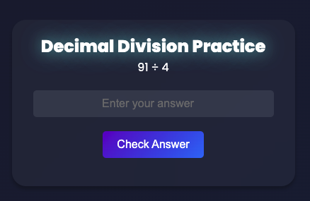

# T3S Games 🎮✨  

Welcome to **T3S Games**! This repository hosts a collection of interactive, fun, and dynamic games created to entertain and inspire. Whether you're here to play, contribute, or learn, this is the place for you!  

  

---

## 🚀 Features  

- 🎮 **Diverse Game Collection**: Explore a variety of games designed for all ages.  
- 📱 **Responsive Design**: Works on desktop, mobile, and tablets seamlessly.  

---

---

## 🎲 Games Collection  

Explore the exciting games available in this repository:

### 1. **Flappy Bird**  
  
Test your reflexes in this addictive classic! Navigate the bird through pipes without crashing.  
[**Play Now**](https://tomik492.github.io/t3sgames/flappybird/flappybird.html)  

---

### 2. **10x10 Tic-Tac-Toe**  
  
Challenge yourself in a strategic 10x10 Tic-Tac-Toe game against an AI. Choose your difficulty level and aim for victory!  
[**Play Now**](https://tomik492.github.io/t3sgames/tictactoe/tictactoe.html)  

---

### 3. **Decimal Multiplication**  
  
Enhance your math skills with random decimal multiplication problems. Perfect for quick brain exercises!  
[**Play Now**](https://tomik492.github.io/t3sgames/decimal_multiplication/decimal.html)  

---

### 4. **Decimal Division**  
  
Practice dividing decimal numbers in a fun and engaging way. Get immediate feedback on your answers!  
[**Play Now**](https://tomik492.github.io/t3sgames/decimal_division/decimal.html)  

---

### 5. **Coming Soon!**  
Stay tuned for more exciting games being added to the collection.  
  

